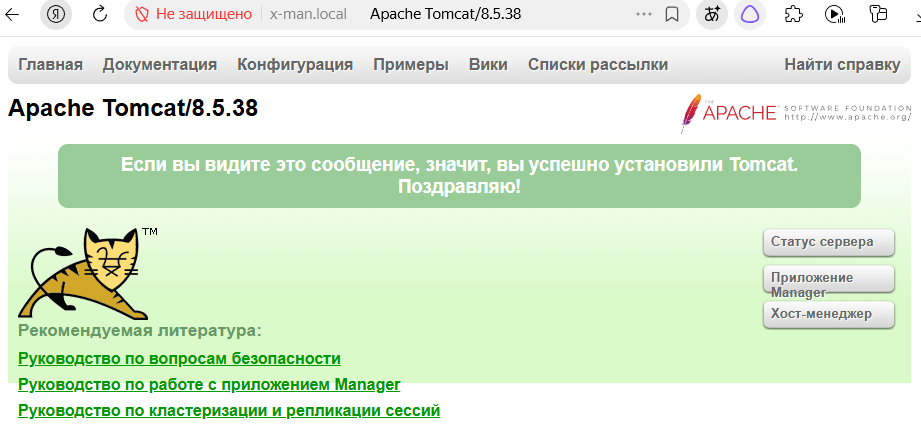

Ingress Controller в Kubernetes

NodePort открывает случайный порт на каждой ноде, LoadBalancer создаёт отдельный внешний IP на каждый сервис. Оба подхода плохо масштабируются: чем больше сервисов, тем больше портов или балансировщиков (сопровождается затратами). И ни один из них не умеет маршрутизировать трафик по содержимому запроса (хост, путь).

Ingress — объект Kubernetes, описывающий правила HTTP/HTTPS-маршрутизации. Один Ingress может обслуживать десятки сервисов через один внешний IP.

Но сам Ingress — только описание правил. Он не работает без Ingress Controller — программы, которая читает эти правила и настраивает реальный прокси (Nginx, HAProxy, Envoy).

Схема потока трафика
Клиент (http://shop.example.com/, http://api.example.com/v1)
       │
       ▼
┌──────────────────────────────────────────────────────────┐
│          Ingress Controller (Nginx)                      │
│  Правила Ingress:                                        │
│    shop.example.com  → service: shop-svc:80              │
│    api.example.com   → service: api-svc:8080             │
│    /admin            → service: admin-svc:80             │
└──────────────────────────────────────────────────────────┘
       │  смотрит Host и путь → направляет
       ▼
┌──────────────────────────────────────────────────────────┐
│              Service (ClusterIP)                         │
│      shop-svc        api-svc        admin-svc            │
└──────────────────────────────────────────────────────────┘
       │
       ▼
┌──────────────────────────────────────────────────────────┐
│                        Pods                              │
└──────────────────────────────────────────────────────────┘

Ingress работает на L7 (видит HTTP-заголовки, пути, хосты). Service LoadBalancer — на L4 (просто балансирует TCP).

Типы маршрутизации:
1) Single Service — весь трафик в один сервис:
spec:
  defaultBackend:
    service:
      name: my-app
      port: { number: 80 }

2) Fan-out (по пути) — разные пути → разные сервисы:
spec:
  rules:
  - host: myapp.example.com
    http:
      paths:
      - path: /api
        pathType: Prefix
        backend:
          service: { name: api-service, port: { number: 8080 } }
      - path: /admin
        pathType: Prefix
        backend:
          service: { name: admin-service, port: { number: 80 } }

3) Name-based Virtual Hosting (по хосту) — один IP, много доменов:

spec:
  rules:
  - host: shop.example.com
    http:
      paths:
      - path: /
        pathType: Prefix
        backend:
          service: { name: shop-service, port: { number: 80 } }
  - host: api.example.com
    http:
      paths:
      - path: /
        pathType: Prefix
        backend:
          service: { name: api-service, port: { number: 8080 } }

4) TLS Termination — приём HTTPS, расшифровка на входе, дальше HTTP:

spec:
  tls:
  - hosts: [shop.example.com]
    secretName: shop-tls-secret   # Secret с tls.crt и tls.key
  rules:
  - host: shop.example.com
    http:
      paths:
      - path: /
        pathType: Prefix
        backend:
          service: { name: shop-service, port: { number: 80 } }

IngressClass
Если в кластере несколько контроллеров (Nginx + AWS ALB), IngressClass определяет, какой обслуживает какой Ingress:

apiVersion: networking.k8s.io/v1
kind: IngressClass
metadata:
  name: nginx
spec:
  controller: k8s.io/ingress-nginx

Сравнение с Service типами
            NodePort	    LoadBalancer	           Ingress
Уровень	      L4	             L4	                     L7
По хосту	  Нет	             Нет	                 Да
По пути	      Нет	             Нет	                 Да
TLS	          Нет	       Зависит от облака	         Да
Стоимость	Бесплатно      Дорого (LB на сервис)	Один LB на всё
IP	       Один на ноду	      Один на сервис	       Один на все правила

Ingress — не замена Service, а надстройка: Ingress маршрутизирует на Service, Service — на Pods.

Резюме
Ingress — объект с правилами HTTP/HTTPS-маршрутизации (хост, путь, TLS) к Service.

Ingress Controller — программа, читающая правила и настраивающая прокси. Без него Ingress не работает.

Зачем: один IP на много сервисов, L7-маршрутизация, централизованный TLS.

Типы: defaultBackend, Fan-out (путь), Name-based (хост), TLS termination.

IngressClass — выбор контроллера для Ingress.

Отличие от Service: Service — L4, Ingress — L7 поверх Service.

Ingress - доставка внешнего трафика внутрь кластера

Практика

Для реализации практической части буду использовать contour
(https://github.com/projectcontour/contour?ysclid=muc471d267178186688)

kubectl apply -f https://projectcontour.io/quickstart/contour.yaml

kubectl get pods -n projectcontour -o wide

kubectl get pods -n projectcontour -o wide
NAME                            READY   STATUS      RESTARTS   AGE     IP           NODE     NOMINATED NODE   READINESS GATES
contour-7b7f9d9f8b-6prm5        1/1     Running     0          5m39s   10.42.1.35   node-1   <none>           <none>
contour-7b7f9d9f8b-spfzf        1/1     Running     0          5m40s   10.42.2.30   node-2   <none>           <none>
contour-certgen-v1-33-7-qbhp6   0/1     Completed   0          5m40s   10.42.1.33   node-1   <none>           <none>
envoy-gqtsv                     0/2     Pending     0          5m37s   <none>       <none>   <none>           <none>
envoy-l8gt2                     0/2     Pending     0          5m37s   <none>       <none>   <none>           <none>
envoy-pczkq                     0/2     Pending     0          5m38s   <none>       <none>   <none>  

kubectl describe pods -n projectcontour envoy-gqtsv
envoy:
    Image:       docker.io/envoyproxy/envoy:distroless-v1.38.4
    Ports:       8080/TCP (http), 8443/TCP (https), 8002/TCP (metrics)
    Host Ports:  80/TCP (http), 443/TCP (https), 0/TCP (metrics)

В описании пода (kubectl describe pod envoy-gqtsv -n projectcontour):
Warning  FailedScheduling  9m56s (x2 over 14m)  default-scheduler  0/3 nodes are available: 1 node(s) didn't have free ports for the requested pod ports, 2 node(s) didn't satisfy plugin(s) [NodeAffinity]. no new claims to deallocate, preemption: 0/3 nodes are available: 1 No preemption victims found for incoming pod, 2 Preemption is not helpful for scheduling.

Поды envoy не могут запуститься, потому что не могут «занять» порты, которые им нужны на каждой ноде. В k3s есть встроенный ServiceLB (Klipper), который тоже использует hostPort 80 и 443 для реализации сервисов типа LoadBalancer

Отключу hostPort у Envoy
Contour и Envoy разделены по ролям:

Contour (control plane): это Deployment, который читает Ingress/HTTPProxy объекты из API Kubernetes и транслирует их в конфигурацию xDS для Envoy. Он не принимает трафик и не зависит от того, как Envoy «выставлен наружу».

Envoy (data plane): это DaemonSet (или Deployment), который принимает реальный трафик и проксирует его на сервисы. Именно Envoy слушает порты 80/443.
hostPort — это просто директива, которая говорит Envoy'ю «забиндься на порты 80/443 прямо на хосте (ноде)». Это нужно, чтобы к Ingress можно было обратиться по IP любой ноды.

Что произойдёт, если отключить hostPort
Envoy поднимется без прямого захвата портов хоста. Поды Envoy перестанут конкурировать за порты 80/443 с ServiceLB (Klipper) в k3s. Конфликт, из-за которого поды висели в Pending, исчезнет.
Contour продолжит работать. Он всё так же будет читать Ingress и отдавать конфигурацию Envoy'ю. Связка control plane ↔ data plane не разорвётся.
Envoy всё равно будет доступен — но иначе. Вместо hostPort трафик пойдёт через Service типа LoadBalancer (или NodePort/ClusterIP), который создаётся вместе с Contour. В k3s за это как раз отвечает ServiceLB (Klipper). Он поднимет свои поды (svclb-*) и будет форвардить трафик с портов 80/443 на порты Envoy'я.

Установка contour
helm repo add contour https://projectcontour.github.io/helm-charts/
helm repo update

helm install contour contour/contour --namespace projectcontour --create-namespace --set envoy.hostPorts.enable=false

kubectl get pods -n projectcontour -o wide
NAME                               READY   STATUS    RESTARTS   AGE   IP           NODE     NOMINATED NODE   READINESS GATES
contour-contour-6b9d66cb9d-c94t9   1/1     Running   0          65s   10.42.1.38   node-1   <none>           <none>
contour-envoy-5l4jm                2/2     Running   0          65s   10.42.1.36   node-1   <none>           <none>
contour-envoy-822px                2/2     Running   0          65s   10.42.2.32   node-2   <none>           <none>
contour-envoy-9w7gd                2/2     Running   0          65s   10.42.0.32   cp-1     <none>           <none>

kubectl get svc -n projectcontour
NAME            TYPE           CLUSTER-IP      EXTERNAL-IP                                    PORT(S)                      AGE
contour         ClusterIP      10.43.88.251    <none>                                         8001/TCP                     92s
contour-envoy   LoadBalancer   10.43.193.217   192.168.100.11,192.168.100.12,192.168.100.13   80:31739/TCP,443:32528/TCP   92s

Задеплою несколько приложений
kubectl get deployments.apps 
NAME              READY   UP-TO-DATE   AVAILABLE   AGE
avengers-nginx    3/3     3            3           9m17s
avengers-tomcat   2/2     2            2           3m24s
gambit-apache     2/2     2            2           6m58s
spidy-apache      4/4     4            4           7m27s
x-man-nginx       3/3     3            3           10m
x-man-tomcat      2/3     3            2           3m16s

далее необходимо поднять Services
kubectl get services
NAME              TYPE        CLUSTER-IP      EXTERNAL-IP   PORT(S)    AGE
avengers-nginx    ClusterIP   10.43.182.247   <none>        80/TCP     2m46s
avengers-tomcat   ClusterIP   10.43.218.189   <none>        8080/TCP   2m24s
gambit-apache     ClusterIP   10.43.101.125   <none>        80/TCP     95s
kubernetes        ClusterIP   10.43.0.1       <none>        443/TCP    24h
spidy-apache      ClusterIP   10.43.99.149    <none>        80/TCP     88s
x-man-nginx       ClusterIP   10.43.93.20     <none>        80/TCP     74s
x-man-tomcat      ClusterIP   10.43.220.177   <none>        8080/TCP   12s

Прописал в etc/hosts
192.168.100.11  avengers-nginx.local
192.168.100.11  avengers-tomcat.local
192.168.100.11  gambit-apache.local
192.168.100.11  spidy-apache.local
192.168.100.11  x-man-nginx.local
192.168.100.11  x-man-tomcat.local

kubectl apply -f src/ingress_controller/ingress-hosts.yaml 
ingress.networking.k8s.io/ingress-hosts created

kubectl describe ingress ingress-hosts 
Name:             ingress-hosts
Labels:           <none>
Namespace:        default
Address:          192.168.100.11,192.168.100.12,192.168.100.13
Ingress Class:    contour
Default backend:  <default>
Rules:
  Host                   Path  Backends
  ----                   ----  --------
  avengers-nginx.local   
                         /   avengers-nginx:80 (10.42.2.38:80,10.42.1.40:80,10.42.0.35:80)
  avengers-tomcat.local  
                         /   avengers-tomcat:8080 (10.42.1.41:8080,10.42.2.39:8080)
  gambit-apache.local    
                         /   gambit-apache:80 (10.42.0.34:80,10.42.1.42:80)
  spidy-apache.local     
                         /   spidy-apache:80 (10.42.0.36:80,10.42.1.43:80,10.42.0.37:80 + 1 more...)
  x-man-nginx.local      
                         /   x-man-nginx:80 (10.42.2.34:80,10.42.0.38:80,10.42.1.44:80)
  x-man-tomcat.local     
                         /   x-man-tomcat:8080 (10.42.2.37:8080,10.42.1.45:8080,10.42.0.39:8080)
Annotations:             <none>
Events:                  <none>

Не получается открыть страницу через браузер

Все Service работают
Правила настроены верно 
kubectl describe ingress ingress-hosts
Name:             ingress-hosts
Labels:           <none>
Namespace:        default
Address:          192.168.100.11,192.168.100.12,192.168.100.13
Ingress Class:    contour
Default backend:  <default>
Rules:
  Host                   Path  Backends
  ----                   ----  --------
  avengers-nginx.local   
                         /   avengers-nginx:80 (10.42.2.38:80,10.42.1.40:80,10.42.0.35:80)
  avengers-tomcat.local  
                         /   avengers-tomcat:8080 (10.42.1.41:8080,10.42.2.39:8080)  gambit-apache.local    
                         /   gambit-apache:80 (10.42.0.34:80,10.42.1.42:80)
  spidy-apache.local     
                         /   spidy-apache:80 (10.42.0.36:80,10.42.1.43:80,10.42.0.37:80 + 1 more...)
  x-man-nginx.local      
                         /   x-man-nginx:80 (10.42.2.34:80,10.42.0.38:80,10.42.1.44:80)
  x-man-tomcat.local     
                         /   x-man-tomcat:8080 (10.42.2.37:8080,10.42.1.45:8080,10.42.0.39:8080)
Annotations:             <none>
Events:                  <none>

ingress запущен
kubectl get ingress ingress-hosts -o yaml | grep ingressClassName 
  ingressClassName: contour

curl -v -H "Host: avengers-nginx.local" http://192.168.100.11/ возвращает успешную страницу

пинг проходит 
ping avengers-nginx.local
PING avengers-nginx.local (192.168.100.11) 56(84) bytes of data.
64 bytes from avengers-nginx.local (192.168.100.11): icmp_seq=1 ttl=63 time=0.529 ms
64 bytes from avengers-nginx.local (192.168.100.11): icmp_seq=2 ttl=63 time=0.371 ms
64 bytes from avengers-nginx.local (192.168.100.11): icmp_seq=3 ttl=63 time=0.359 ms
64 bytes from avengers-nginx.local (192.168.100.11): icmp_seq=4 ttl=63 time=1.09 ms

Понял проблему, etc/hosts находится на wsl
Я запускаю браузер с win машины, поэтому необходимо прописать хосты и туда, потом обновить dns кеш ipconfig /flushdns

После этого все успешно работает

Здесь есть широкий спектр возможностей для rewrite или анотаций, необходимых для роутинга по запросам

#TODO
создать host x-man.local и создать роутинг на пути /tomcat  --> x-man-tomcat, аналогично для nginx
http://x-man.local/tomcat/  →  x-man-tomcat:8080
http://x-man.local/nginx/   →  x-man-nginx:80

в случае с contour это делается через httpProxy + rewrite

Contour намеренно устроен так, что каждый HTTPProxy с virtualhost (root proxy) может содержать только один FQDN . Это отличается от стандартного Kubernetes Ingress, где можно было перечислить несколько хостов в одном объекте.

В официальной документации прямо сказано: если у вас Ingress с несколькими хостами, его нельзя представить одним HTTPProxy — нужно создавать отдельный HTTPProxy на каждый домен

создал объект httpProxy (src\ingress_controller\ingress-httpproxy-x-man.yaml)

kubectl get httpproxy
NAME          FQDN          TLS SECRET   STATUS   STATUS DESCRIPTION
x-man-proxy   x-man.local                valid    Valid HTTPProxy

http://x-man.local/nginx - успешно работает

http://x-man.local/tomcat - возвращает 404

Открыл форвардинг на админку envoy
kubectl port-forward -n projectcontour contour-envoy-5l4jm 9001:9001
Forwarding from 127.0.0.1:9001 -> 9001
Forwarding from [::1]:9001 -> 9001
Handling connection for 9001
Handling connection for 9001

В другом терминале запросил список известных хостов для envoy
curl -s http://localhost:9001/config_dump | jq -r '.configs[].dynamic_route_configs[]?.route_config.virtual_hosts[]?.name' 2>/dev/null
avengers-nginx.local
avengers-tomcat.local
gambit-apache.local
spidy-apache.local
x-man-nginx.local
x-man-tomcat.local
x-man.local

Contour работает — он передал все правила Envoy'ю,
Envoy работает — он видит все 7 виртуальных хостов (6 из Ingress + 1 из HTTPProxy),
Ingress подхвачен — все шесть хостов на месте,
HTTPProxy подхвачен — x-man.local тоже здесь.

Envoy знает все маршруты, rewrite настроен корректно, кластеры (default/x-man-tomcat/8080, default/x-man-nginx/80) существуют. Проблема не в маршрутизации.

Значит, 404 отдаёт сам Tomcat. Проблема заключалась в версии томката, старая версия работает из корня, новые не. Пересоздал Deployment с нужным образом.

