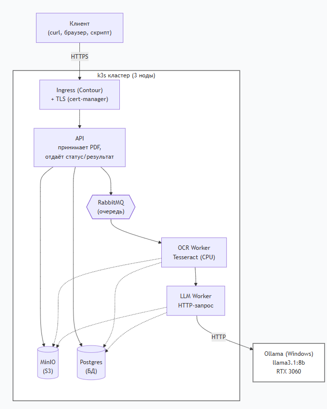

Компонент	                               Что делает	                                           
Ingress (Contour)	     Принимает HTTP/HTTPS извне, роутит на API	            
cert-manager	         Автоматически выдаёт TLS-сертификаты	                
API (FastAPI)	         REST-интерфейс: принимает PDF, отдаёт статус/результат	       
MinIO (S3)	             Хранит файлы: оригиналы PDF, текст после OCR, JSON-результаты	
PostgreSQL	             Хранит метаданные: id, статус, таймстемпы, размеры, ошибки	
RabbitMQ	             Очереди задач: ocr.queue, llm.queue, failed.queue	
OCR Worker	             Забирает PDF из S3 → Tesseract → текст в S3 → задача в llm.queue
LLM Worker	             Забирает текст из S3 → HTTP-запрос к Ollama → JSON в S3 + БД	

Алгоритм работы
1. Клиент → POST /documents (PDF)
   │
2. API:
   ├─ Сохраняет PDF в MinIO:       docs/{id}/original.pdf
   ├─ Пишет запись в PostgreSQL:   status=uploaded
   └─ Публикует в RabbitMQ:        ocr.queue
   │
3. OCR Worker:
   ├─ Забирает задачу из ocr.queue
   ├─ Скачивает PDF из MinIO
   ├─ Прогоняет через Tesseract
   ├─ Сохраняет текст в MinIO:     docs/{id}/text.txt
   ├─ Обновляет PostgreSQL:        status=ocr_done
   └─ Публикует в RabbitMQ:        llm.queue
   │
4. LLM Worker:
   ├─ Забирает задачу из llm.queue
   ├─ Скачивает текст из MinIO
   ├─ HTTP POST → Ollama (Windows): /api/generate
   ├─ Валидирует JSON по схеме
   ├─ Сохраняет результат в MinIO: docs/{id}/result.json
   └─ Обновляет PostgreSQL:        status=completed
   │
5. Клиент → GET /documents/{id}/result
   └─ API отдаёт JSON из MinIO

REST API
Метод	Путь	                   Что делает
POST	/documents	               Загрузить PDF (multipart/form-data) → {id, status}
GET	    /documents/{id}	           Статус и метаданные
GET	    /documents/{id}/result	   Готовый JSON-результат
GET	    /documents	               Список с фильтрами (status, date)
GET	    /healthz	               Liveness probe
GET	    /readyz	                   Readiness probe
GET	    /metrics	               Prometheus-метрики
