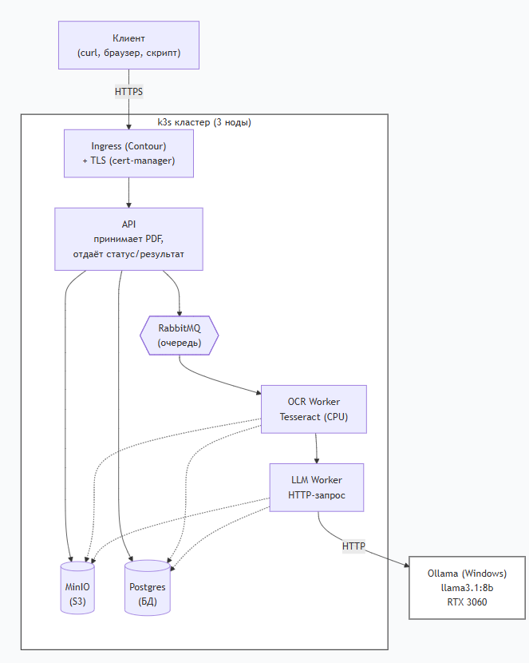

Компонент	                               Что делает	                                           
Ingress (Contour)	     Принимает HTTP/HTTPS извне, роутит на API	            
cert-manager	         Автоматически выдаёт TLS-сертификаты	                
API (FastAPI)	         REST-интерфейс: принимает PDF, отдаёт статус/результат	       
MinIO (S3)	             Хранит файлы: оригиналы PDF, текст после OCR, JSON-результаты	
PostgreSQL	             Хранит метаданные: id, статус, таймстемпы, размеры, ошибки	
RabbitMQ	             Очереди задач: ocr.queue, llm.queue, failed.queue	
OCR Worker	             Забирает PDF из S3 → Tesseract → текст в S3 → задача в llm.queue
LLM Worker	             Забирает текст из S3 → HTTP-запрос к Ollama → JSON в S3 + БД	

Алгоритм работы
1. Клиент → POST /documents (PDF)
   │
2. API:
   ├─ Сохраняет PDF в MinIO:       docs/{id}/original.pdf
   ├─ Пишет запись в PostgreSQL:   status=uploaded
   └─ Публикует в RabbitMQ:        ocr.queue
   │
3. OCR Worker:
   ├─ Забирает задачу из ocr.queue
   ├─ Скачивает PDF из MinIO
   ├─ Прогоняет через Tesseract
   ├─ Сохраняет текст в MinIO:     docs/{id}/text.txt
   ├─ Обновляет PostgreSQL:        status=ocr_done
   └─ Публикует в RabbitMQ:        llm.queue
   │
4. LLM Worker:
   ├─ Забирает задачу из llm.queue
   ├─ Скачивает текст из MinIO
   ├─ HTTP POST → Ollama (Windows): /api/generate
   ├─ Валидирует JSON по схеме
   ├─ Сохраняет результат в MinIO: docs/{id}/result.json
   └─ Обновляет PostgreSQL:        status=completed
   │
5. Клиент → GET /documents/{id}/result
   └─ API отдаёт JSON из MinIO

REST API
Метод	Путь	                   Что делает
POST	/documents	               Загрузить PDF (multipart/form-data) → {id, status}
GET	    /documents/{id}	           Статус и метаданные
GET	    /documents/{id}/result	   Готовый JSON-результат
GET	    /documents	               Список с фильтрами (status, date)
GET	    /healthz	               Liveness probe
GET	    /readyz	                   Readiness probe
GET	    /metrics	               Prometheus-метрики

### Три приложения:

Приложение	         Роль
API	               HTTP-интерфейс: приём PDF, выдача статуса и результата
OCR Worker	         Слушает ocr.queue, прогоняет PDF через Tesseract
LLM Worker	         Слушает llm.queue, структурирует текст через Ollama

Схема потока данных

┌─────────────────────────────────────────────────────────────────────┐
│ Клиент                                                              │
│   POST /documents (PDF)                                             │
│   GET  /documents/{id}                                              │
│   GET  /documents/{id}/result                                       │
└──────────────────────────────┬──────────────────────────────────────┘
                               │
                               ▼
┌─────────────────────────────────────────────────────────────────────┐
│ API Service (FastAPI)                                               │
│   • Принимает PDF                                                   │
│   • Кладёт в S3: originals/{id}.pdf                                 │
│   • Создаёт запись в БД: status=uploaded                            │
│   • Публикует в RabbitMQ: ocr.queue { document_id }                 │
│   • Отвечает: 202 Accepted { id }                                   │
└──────────────────────────────┬──────────────────────────────────────┘
                               │
                               ▼ ocr.queue
┌─────────────────────────────────────────────────────────────────────┐
│ OCR Worker                                                          │
│   • Забирает сообщение                                              │
│   • Скачивает PDF из S3                                             │
│   • Прогоняет через Tesseract                                       │
│   • Кладёт текст в S3: extracted/{id}.txt                           │
│   • Обновляет БД: status=ocr_done                                   │
│   • Публикует в RabbitMQ: llm.queue { document_id }                 │
│   • ack                                                             │
└──────────────────────────────┬──────────────────────────────────────┘
                               │
                               ▼ llm.queue
┌─────────────────────────────────────────────────────────────────────┐
│ LLM Worker                                                          │
│   • Забирает сообщение                                              │
│   • Скачивает текст из S3                                           │
│   • Отправляет в Ollama (HTTP)                                      │
│   • Валидирует JSON                                                 │
│   • Кладёт результат в S3: results/{id}.json                        │
│   • Обновляет БД: status=completed, result_json={...}               │
│   • ack                                                             │
└─────────────────────────────────────────────────────────────────────┘

GET /documents/{id} → { status: "uploaded" | "ocr_done" | "completed" | "failed" }
GET /documents/{id}/result → { ...структурированный JSON... } (только если completed)

### Схема БД (PostgreSQL)

Таблица documents:

| Поле | Тип | Описание |
|---|---|---|
| `id` | `UUID PK` | Идентификатор документа |
| `original_filename` | `TEXT` | Имя загруженного файла |
| `status` | `TEXT` | Статус: `uploaded`, `ocr_processing`, `ocr_done`, `llm_processing`, `completed`, `failed` |
| `s3_original_key` | `TEXT` | Путь к PDF в S3 (`originals/{id}.pdf`) |
| `s3_extracted_key` | `TEXT` | Путь к тексту (`extracted/{id}.txt`), `NULL` до OCR |
| `s3_result_key` | `TEXT` | Путь к результату (`results/{id}.json`), `NULL` до LLM |
| `result_json` | `JSONB` | Структурированный результат |
| `error_message` | `TEXT` | Если `failed` — что пошло не так |
| `created_at` | `TIMESTAMPTZ` | Когда создан |
| `updated_at` | `TIMESTAMPTZ` | Когда обновлён |

### Схема S3 (MinIO)
Bucket documents, три «папки»:
documents/
├── originals/
│   └── {id}.pdf           ← загруженные PDF
├── extracted/
│   └── {id}.txt           ← текст после OCR
└── results/
    └── {id}.json          ← структурированный JSON от LLM

### API: endpoints

1. POST /documents
Что принимает: PDF-файл (multipart/form-data).

Что делает:
-Валидирует: тип application/pdf, размер ≤ 50 MB.
-Генерирует id = uuid4().
-Кладёт в S3: originals/{id}.pdf.
-Создаёт запись в БД: status=uploaded.
-Публикует в ocr.queue: { "document_id": "..." }.
-Возвращает 202 Accepted с { "id": "...", "status": "uploaded" }.
-Почему 202, не 200: обработка асинхронная. Документ принят, но не обработан.

Метрики Prometheus: api_documents_uploaded_total, api_upload_duration_seconds

2. GET /documents/{id}
Что делает: возвращает статус документа.

Ответ: { "id": "...", "status": "...", "created_at": "...", "updated_at": "..." }.

404, если не найден.

Метрики: api_documents_status_requests_total{status="..."}.

3. GET /documents/{id}/result
Что делает: возвращает результат LLM.

Ответ:
200 + result_json, если status=completed.
404, если документ не найден.
409 Conflict, если status != completed — «ещё не готов».

Метрики: api_documents_result_requests_total{status="..."}.

4. GET /documents
Что делает: список документов с фильтром и пагинацией.

Query params: status, limit, offset.

Ответ: { "items": [...], "total": N }.

5. GET /healthz
Liveness probe. Просто 200 OK.

6. GET /readyz
Readiness probe. Проверяет:

-БД доступна (SELECT 1).
-S3 доступен (HEAD bucket).
-RabbitMQ доступен (соединение).

Если хоть что-то упало — 503. K8s уберёт pod из Service.

7. GET /metrics
Prometheus-метрики.

### OCR Worker
Запуск: слушает ocr.queue.

Обработка одного сообщения:
Парсит { document_id }.
Обновляет БД: status=ocr_processing.
Скачивает PDF из S3.
Прогоняет через Tesseract.
Кладёт текст в S3: extracted/{id}.txt.
Обновляет БД: status=ocr_done, s3_extracted_key.
Публикует в llm.queue: { document_id }.
Ack сообщение.

При ошибке:
Обновляет БД: status=failed, error_message=....
Ack сообщение (не re-queue — не хотим бесконечный retry).
Или nack с requeue, если ошибка временная (сеть, S3 недоступен).

Метрики:
ocr_processed_total{status="success|failed"}.
ocr_duration_seconds — histogram.
ocr_errors_total{type="..."}.
ocr_active_jobs — gauge.

Prefetch = 1. Один воркер обрабатывает одно сообщение за раз.

### LLM Worker
Запуск: слушает llm.queue.

Обработка одного сообщения:
Парсит { document_id }.
Обновляет БД: status=llm_processing.
Скачивает текст из S3.
Формирует промпт для LLM.
Отправляет в Ollama (HTTP POST /api/generate или /api/chat).
Парсит ответ — ожидает JSON.
Валидирует JSON по схеме.
Кладёт результат в S3: results/{id}.json.
Обновляет БД: status=completed, result_json, s3_result_key.
Ack.

Валидация JSON:
Pydantic-модель — описывает ожидаемую структуру.
Если LLM вернул невалидный JSON — retry с другим промптом или fail.

Метрики:
llm_processed_total{status="success|failed"}.
llm_duration_seconds.
llm_errors_total{type="ollama_timeout|invalid_json|..."}.
llm_tokens_total (если Ollama возвращает usage).
llm_active_jobs.

Обработка ошибок Ollama:
Timeout (30 сек) — nack с requeue, retry.
500 — nack с requeue.
Invalid JSON — fail, сохранить в БД для отладки.

### Метрики Prometheus
| Метрика | Тип | Описание |
|---|---|---|
| `*_processed_total` | `Counter` | Сколько обработано (success/failed) |
| `*_duration_seconds` | `Histogram` | Время обработки |
| `*_errors_total` | `Counter` | Ошибки по типам |
| `*_active_jobs` | `Gauge` | Сколько обрабатывается сейчас |

Для API дополнительно:
http_requests_total{method, path, status}.
http_request_duration_seconds{method, path} — histogram.

